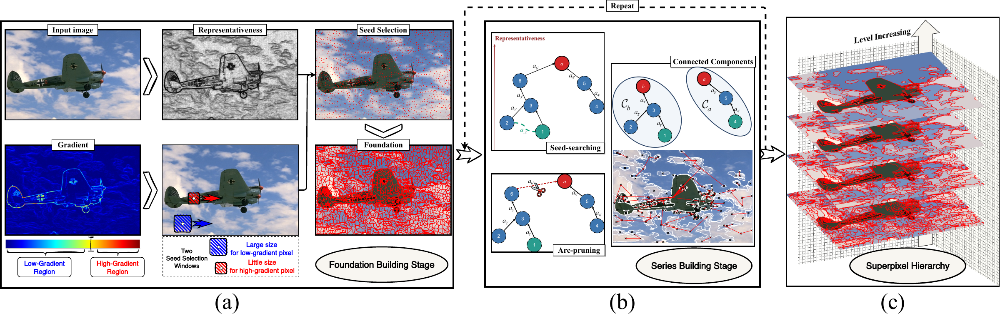

# Hierarchical Superpixel Segmentation by Searching Seeds

Source code for our [paper](https://ieeexplore.ieee.org/abstract/document/11691956/) **Hierarchical Superpixel Segmentation by Searching Seeds**, published in IEEE Transactions on Image Processing (TIP), 2026. Doi: 10.1109/TIP.2026.3731595

## Workflow


## Requirements

- Tested with MATLAB R2022b
- Image Processing Toolbox
- A supported C++ compiler if the included MEX files must be rebuilt

## Run the demo

Open MATLAB in the repository directory and run:

```matlab
setup_hsss
demo
```

The demo uses one of the sample images in `examples/BSDS500`. The image,
edge-map mode, and requested superpixel numbers can be changed near the top
of `demo.m`:

```matlab
image_id = '3063';
edge_mode = 'sobel';       % 'sobel' or 'rcf'
target_count = [1200, 1000, 800];
```

`sobel` computes the edge map from the input image. `rcf` reads the saved
`<image_id>_rcf.png` file.

By default, `demo` also runs the bundled BR/IBR evaluation example. Set
`run_evaluation_demo = false` near the top of `demo.m` to skip it.

## Rebuild the MEX files

Precompiled Windows MEX files are included. On another platform, or if the
binaries are incompatible with the installed MATLAB version, run:

```matlab
mex -setup C++
build_mex
```

Then run `demo` again.

## Use your own image

```matlab
setup_hsss
image = imread('your_image.jpg');
options = struct('EdgeMap', [], ...
                 'EdgePercentile', 60, ...
                 'RandomSeed', 0, ...
                 'SpatialWeight', 0.5, ...
                 'SearchRadiusMultiplier', 5);
[label_maps, info] = hsss_segment(image, [800, 600, 400], options);
```

Leave `EdgeMap` empty to use Sobel, or provide an edge-map array or image path.

## Evaluation

Run the bundled evaluation example:

```matlab
run('examples/BSDS500/demo_eval.m')
```

The demo reports Boundary Recall (BR) and Instance Boundary Recall (IBR).
The benchmark for experiments is from [davidstutz/superpixel-benchmark](https://github.com/davidstutz/superpixel-benchmark).
IBR is not included in that project and is introduced in our paper.

## Citation

Please cite the paper if you find it useful
```bibtex
@article{zhang2026hierarchical,
  title={Hierarchical Superpixel Segmentation by Searching Seeds},
  author={Zhang, Yuxuan and Guan, Junyi and Ji, Xiuli and Zhao, Yangyang and He, Xiongxiong and Li, Sheng},
  journal={IEEE Transactions on Image Processing},
  volume={35},
  pages={9773--9788},
  year={2026},
  publisher={IEEE}
}
```

## License

MIT License. See [LICENSE](LICENSE).
